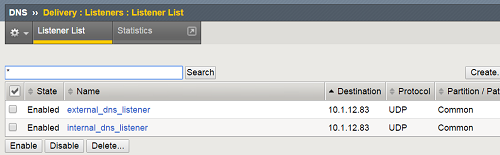
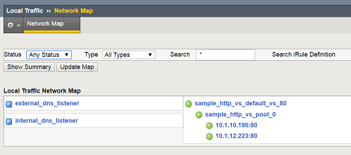
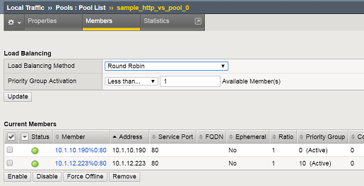
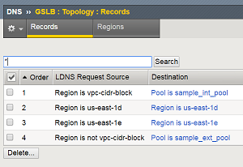

AWS Cross-AZ DNS Demo
=====================

Scripts that automates the process outlined in the following article.  
DevCentral article: [DNS based failover between AWS Availability Zones and Split DNS](https://devcentral.f5.com/articles/dns-based-failover-between-aws-availability-zones-and-split-dns)

*WORK IN PROGRESS!!!*

### About

* create-stack.py: Launches AWS CFT templates used in the demo
* bgip_dns_helper.py: Script that helps with BIG-IP DNS module
* dns-demo.py: Runs the demo
* iapps/: Scripts for deploy Application Services iapps
* templates/: AWS CFT templates
* params/: Sample inputs for CFT templates (modify to match your environment)
* build/: Modified build scripts used to create CFT templates

### Requirements
   Python 2.7

   Python Modules: f5-sdk , boto3, pexpect

   F5 BIG-IP LTM/DNS > 12.0.0

   4 Subnets (Mgmt/Public)
   2 Availability Zones
   Security Groups

### Example Inputs

Create virtualenv and install required Modules
```

virtualenv demoenv
. demoenv/bin/activate
pip install -r requirements.txt

```

Create a CFT stack that will create a MGMT/Public ENI.

  ```
  python create-stack.py -t templates/create-eni-stack.template -p params/eni-stack-params-az1.json -s erchen-az1-eni-stack
  python create-stack.py -t templates/create-eni-stack.template -p params/eni-stack-params-az2.json -s erchen-az2-eni-stack

```

Modify Security Group to allow primary EIP of 2nd ENI to connect to ports 22/4353

Launch BIG-IP instances using 25Mbps Better hourly license.

```
./create-stack.py -t templates/bigip-hourly-stack.template -p params/bigip-hourly-stack-params.json --password-file=admin_passwd.txt --sshkey=erchen -i erchen-az1-eni-stack -s erchen-bigip-1
./create-stack.py -t templates/bigip-hourly-stack.template -p params/bigip-hourly-stack-params.json --password-file=admin_passwd.txt --sshkey=erchen -i erchen-az2-eni-stack -s erchen-bigip-2
```

Configure BIG-IP DNS and create sync cluster (DNS)

```
./dns-demo.py --action setup_dns --primary_stack erchen-bigip-1 --secondary_stack erchen-bigip-2 --password-file admin_passwd.txt
./dns-demo.py --action gtm_add --primary_stack erchen-bigip-1 --secondary_stack erchen-bigip-2 --password-file admin_passwd.txt
./dns-demo.py --action setup_dns2 --primary_stack erchen-bigip-1 --secondary_stack erchen-bigip-2 --password-file admin_passwd.txt
```

Install Application Services iApp, Deploy Sample Virtual Server, and setup DNS.

```
./dns-demo.py --action import_iapp --primary_stack erchen-bigip-1 --secondary_stack erchen-bigip-2 --password-file admin_passwd.txt
./dns-demo.py --action deploy_primary_vs1 --pool_members  0:10.1.10.190:80:0:1:10:enabled:none,0:10.1.12.223:80:0:1:0:enabled:none --primary_stack erchen-bigip-1 --secondary_stack erchen-bigip-2 --password-file admin_passwd.txt
./dns-demo.py --action deploy_secondary_vs1 --pool_members 0:10.1.12.223:80:0:1:10:enabled:none,0:10.1.10.190:80:0:1:0:enabled:none --primary_stack erchen-bigip-1 --secondary_stack erchen-bigip-2 --password-file admin_passwd.txt
./dns-demo.py --action deploy_vs1_dns --primary_stack erchen-bigip-1 --secondary_stack erchen-bigip-2 --password-file admin_passwd.txt
```

Resulting Configuration

2x DNS listeners for external/internal clients



Virtual Server / Pools



Use of priority groups to provide affinity to Availability Zone from LTM.



Topology records to provide split DNS and  affinity to internal requests.


### Authored By

[Eric Chen](https://devcentral.f5.com/users/123940) | [@chen23](https://github.com/chen23)
