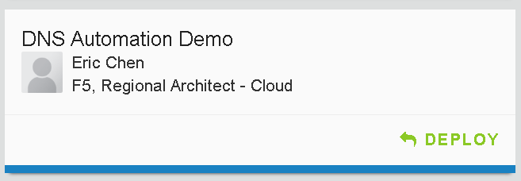
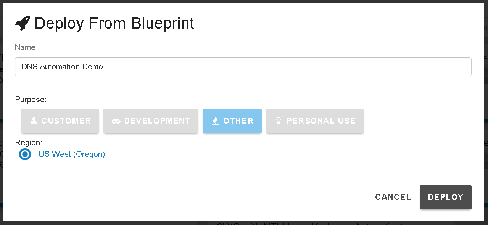
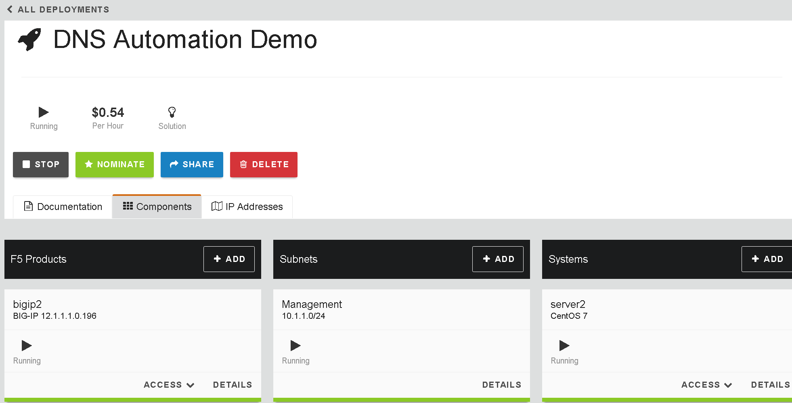
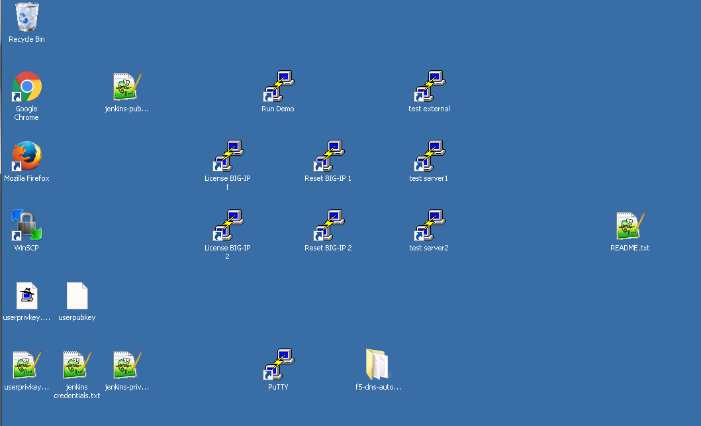

Connecting to UDF 2.0
=====================

This lab goes through the process of launching the demo environment, connecting via Windows RDP, and licensing/resetting the BIG-IP devices.

Launching Deployment
====================

From https://federate.f5.com find the "UDF" link and click on it.

.. image:: federate-udf-link.png
   :scale: 50%
   :align: center
   
You should see the main UDF page.  Click on the "Blueprints" link.

.. image:: udf-main-page.png
   :scale: 50%
   :align: center
   
Find the "DNS Automation Demo" Blueprint and click on "Deploy"

   
You will see "Deploy From Blueprint" and click "Deploy" again.

   
You should now see the "DNS Automation Demo" screen that has the "Start" button listed.

Click on "Start".

.. image:: start-deployment.png
   :scale: 50%
   :align: center
   
The Deployment is now starting.

.. image:: deployment-starting.png
   :scale: 50%
   :align: center

Connecting with Windows RDP
===========================
   
Once the Deployment is finished starting click on the "Components" tab to get a view like the following.

Find the win2008-rdp component and click on the "Access" button to display the "RDP" link.

.. image:: win2008-rdp-component.png
   :scale: 50%
   :align: center
   
Download/launch the RDP link.  

| *Note that RDP will launch full screen*
| *For HiDPI displays you may want to re-size your screen first*

The username is "Administrator" and the password can be found under the "Details" page of the win2008-rdp component.  You should see a desktop that looks like the following.

   
Licensing/Resetting BIG-IP
==========================

When a UDF Deployment is started you will need to re-license the device.  There are links on the Desktop to expedite this process.

First find the "License" links.

.. image:: license-links.png
   :scale: 75%
   :align: center

Double-click on both of these and you should see a window appear briefly like the following.

.. image:: license-bigip.png
   :scale: 50%
   :align: center

Next find the "Resetting" links.

.. image:: resetting-links.png
   :scale: 75%
   :align: center

Double-click on both of these and you should see a window appear briefly like the following.

.. image:: resetting-bigip.png
   :scale: 50%
   :align: center
   
| *The previous steps go through a scripted process of resetting the license and*
| *restoring the system to a known state via a UCS restore.*

You are now ready to start the next Lab: :doc:`../lab2/sync-group`
   

