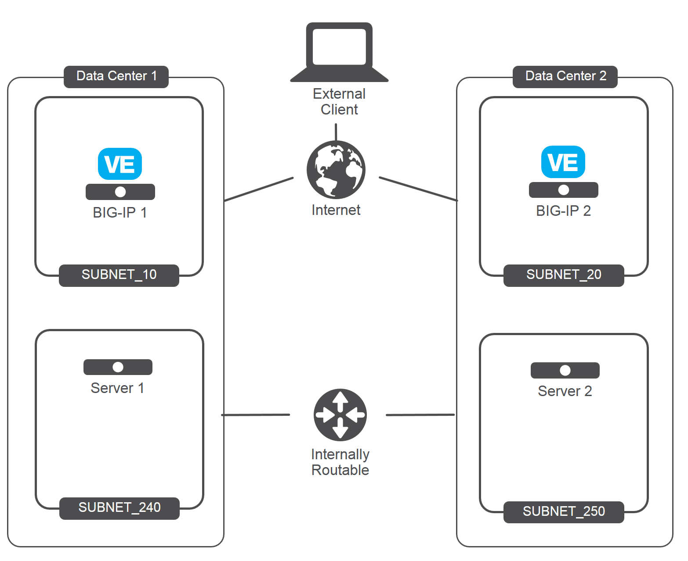
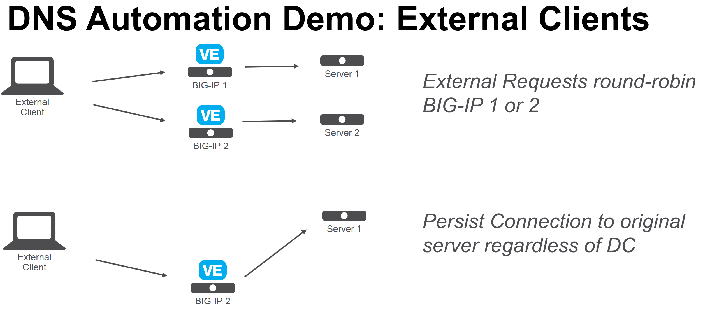
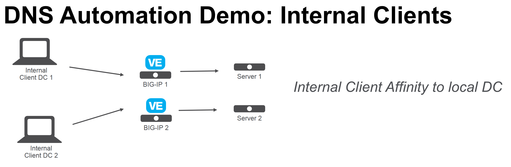

Connecting to UDF 2.0
=====================

This lab goes through the process of launching the demo environment, connecting via Windows RDP, and licensing/resetting the BIG-IP devices.

Launching Deployment
====================

From https://federate.f5.com find the "UDF" link and click on it.

.. image:: federate-udf-link.png
   :scale: 50%
   :align: center
   
You should see the main UDF page.  Click on the "Blueprints" link.

.. image:: udf-main-page.png
   :scale: 50%
   :align: center
   
Find the "DNS Automation Demo" Blueprint and click on "Deploy"

.. image:: udf-dns-automation-demo-blueprint.png
   :scale: 50%
   :align: center
   
You will see "Deploy From Blueprint" and click "Deploy" again.

.. image:: deploy-from-blueprint.png
   :scale: 50%
   :align: center
   
You should now see the "DNS Automation Demo" screen that has the "Start" button listed.

Click on "Start".

.. image:: start-deployment.png
   :scale: 50%
   :align: center
   
The Deployment is now starting.

.. image:: deployment-starting.png
   :scale: 50%
   :align: center
   
About the Demo Environment
==========================

This demo is designed to provide a solution with the following attributes.

 * Two BIG-IP devices in separate Data Centers (Regions, Availability Zone, etc...)
 * Two backend servers in separate DC 
 * The two DC are routable to each other via L3
 * Provide recursive DNS for internal clients
 

 
The desired behavior for requests

 * External clients round-robin between backend servers
 * Persist External client requests to original DC server if requests move between DC
 * Internal client requests will have affinity to local DC server
 

 

Servers in the Demo
===================

==================   ==================  =========================  ==============================================
    Hostname             MGMT IP             Network IP                    Login / Password
==================   ==================  =========================  ==============================================
    win2008-rdp         10.1.1.10              10.1.20.5             administrator / [see details page]
    bigip1              10.1.1.7               10.1.10.240           admin / admin
    bigip2              10.1.1.8               10.1.10.240           admin / admin
    server1              10.1.1.4              10.1.240.10           centos or user / [ssh key] 
    server2              10.1.1.5              10.1.250.10           centos or user / [ssh key]
    automation           10.1.1.6              10.1.20.8             centos or user / [ssh key]
    jenkins              10.1.1.11                                   ubuntu / [ssh key]
==================   ==================  =========================  ==============================================   
   
Connecting with Windows RDP
===========================
Once the Deployment is finished starting click on the "Components" tab to get a view like the following.
   

.. image:: deployment-components.png
   :scale: 50%
   :align: center

Find the win2008-rdp component and click on the "Access" button to display the "RDP" link.

.. image:: win2008-rdp-component.png
   :scale: 50%
   :align: center
   
Download/launch the RDP link.  

| *Note that RDP will launch full screen*
| *For HiDPI displays you may want to re-size your screen first*

The username is "Administrator" and the password can be found under the "Details" page of the win2008-rdp component.  
Note: copy/paste of the password into the RDP session does not work. You can copy the password, open the RDP session settings in your RPD clinet and paste the password there. Save it and open the RDP session. You should see a desktop that looks like the following.

.. image:: windows-desktop.png
   :scale: 50%
   :align: center
   
Licensing/Resetting BIG-IP
==========================

When a UDF Deployment is started you will need to re-license the device.  There are links on the Desktop to expedite this process.

First find the "License" links.

.. image:: license-links.png
   :scale: 75%
   :align: center

Double-click on both of these and you should see a window appear briefly like the following.

.. image:: license-bigip.png
   :scale: 50%
   :align: center

Next find the "Resetting" links.

.. image:: resetting-links.png
   :scale: 75%
   :align: center

Double-click on both of these and you should see a window appear briefly like the following.

.. image:: resetting-bigip.png
   :scale: 50%
   :align: center
   
| *The previous steps go through a scripted process of resetting the license and*
| *restoring the system to a known state via a UCS restore.*

You are now ready to start the next Lab: :doc:`../lab2/sync-group`
   

