Creating BIG-IP DNS Sync Group
==============================

The following is adapted from the official F5 documentation:

https://support.f5.com/kb/en-us/products/big-ip-dns/manuals/product/bigip-dns-implementations-12-1-0/3.html#conceptid

First start by launching Google Chrome.

In Chrome you should see links to BIG-IP 1 and 2.  

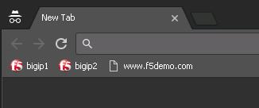

Login to BIG-IP 1 *username: admin, password: admin*

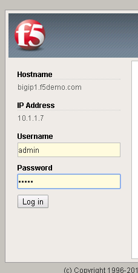

Take a look at the current config.  You should see BIG-IP DNS is provisioned.

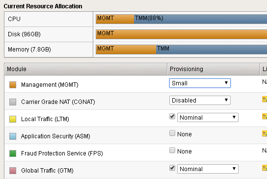

There is an existing self IP.

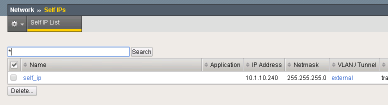
   
   
Configuring BIG-IP DNS
======================

The following will go through the basic steps of setting up BIG-IP DNS.

First go to DNS -> Settings -> GSLB -> General

Find the "Synchronize" checkbox and click on it.

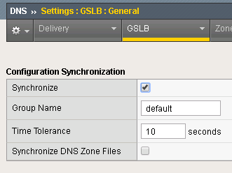

Next go back to DNS -> GSLB -> Data Centers

Create a Data Center (DC) named SUBNET_10 and SUBNET_30.
   
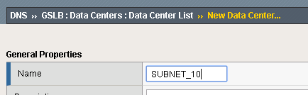

Next go to DNS->GSLB->Servers

Create a server bigip1 associated with SUBNET_10 and bigip2 associated with SUBNET_30.   
   
======== ============= ===========
Name     Address       Data Center
======== ============= ===========
bigip1   10.1.10.240    SUBNET_10
bigip2   10.1.30.240    SUBNET_30
======== ============= ===========
   
.. image:: add-server.png
   :scale: 50%
   :align: center

At this point BIG-IP 1 has the desired BIG-IP DNS configuration, but it needs to be synced with BIG-IP 2.

From the Desktop launch "Putty".

Find the BIG-IP 2 login.

.. image:: connect-bigip2-putty.png
   :scale: 50%
   :align: center

Login. *username: admin, password: admin*

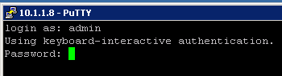

Run the command:

.. code-block:: sh

 run /gtm gtm_add -a admin@10.1.10.240

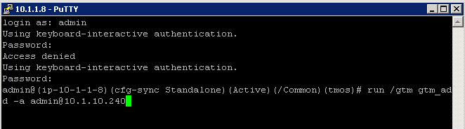

When prompted confirm/enter password.

.. image:: gtm_add-confirm.png
   :scale: 50%
   :align: center

In Chrome login to BIG-IP 2 and you should see that it is now synced.

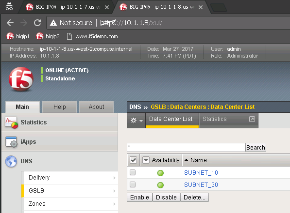

You should have a pair of BIG-IP devices that are in a DNS Sync Group.  The next lab will go through the process of scripting these actions.

Optional Exercises
===================

The full automation will also perform the following.

DNS Cache
---------

In the Demo environment we will use BIG-IP DNS as a DNS resolver.  Create a DNS cache named "dns_cache".

DNS Profiles
------------

Two DNS profiles are required. One for providing a resolving DNS server and one for external DNS requests (bad idea to have an open resolver on the internet). Now crate them.

Under DNS -> Delivery -> Profiles -> DNS:
Create a profile named "external_dns" that only provides GSLB and disables fallback to BIND.

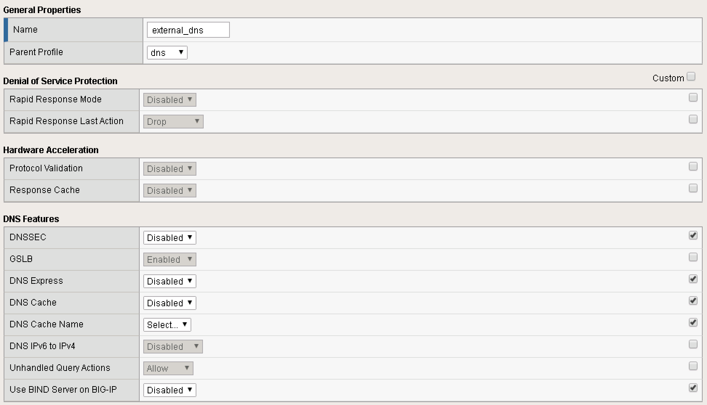

Under DNS -> Caches -> Cache List:
Create a DNS cache profile "internal_cache" and accept default values.

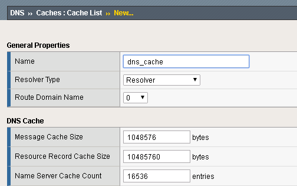
   
Under DNS -> Delivery -> Profiles -> DNS:
Create a profile named "internal_dns" that enables a DNS cache for resolving names.

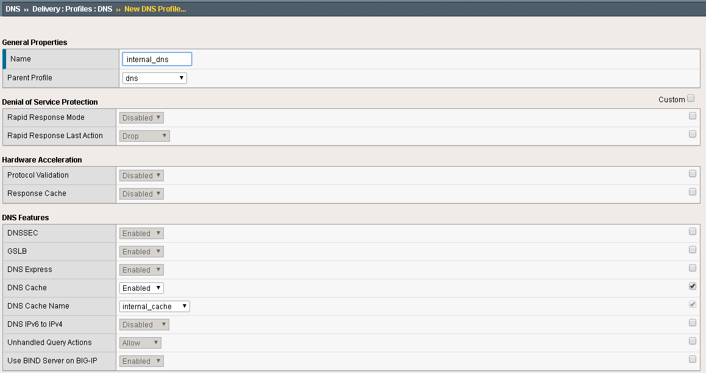

DNS Listeners
-------------

There are two DNS listeners listening on the same IP:PORT.  First create the external listener using BIG-IP DNS menu.  Next create an internal DNS listener via the LTM menu, but specify a source address range.  For the demo all requests go through the internal listener, but in another environment you could split this out.

====== ========== =====
Name   Address    Port
====== ========== =====
bigip1 10.1.10.13 53
bigip2 10.1.30.13 53
====== ========== =====

LTM Configuration
------------------

In the Demo LTM is configured to use cookie persistence, insert X-Forwarded-For headers, and use Priority Groups for delivering traffic.

**Virtual Servers**

======= =========== =========== ==== 
Device  Name        Address     Port 
======= =========== =========== ==== 
bigip1  external_vs 10.1.10.10   80  
bigip1  internal_vs 10.1.10.100  80  
bigip2  external_vs 10.1.30.10   80  
bigip2  internal_vs 10.1.30.100  80  
======= =========== =========== ==== 

**Pools**

======  ==============  ==============  ============== ===============
Device  Pool Member #1  Priority Group  Pool Member #2 Priority Group
======  ==============  ==============  ============== ===============
bigip1  10.1.240.10      10              10.1.250.10    0
bigip2  10.1.250.10      10              10.1.240.10    0
======  ==============  ==============  ============== ===============

DNS Topology
------------

The Demo makes use of DNS Topology to provide split-DNS and also provide traffic affinity to adjacent resources.

**Regions**

================ ==========================
Name             Subnets
================ ==========================
internal_network 10.1.240.0/24
region_1         10.1.10.0/24,10.1.240.0/24
region_2         10.1.30.0/24,10.1.250.0/24
================ ==========================

**Records**

=============================== =========  =============================
Source                          is/is not  Destination
=============================== =========  =============================
region /Common/internal_network is not     pool /Common/external_pool
region /Common/internal_network is         pool /Common/internal_pool
region /Common/region_1         is         region /Common/region_1
region /Common/region_2         is         region /Common/region_2
=============================== =========  =============================

DNS Configuration
-----------------

**Virtual Servers**

====== =========== ===============
Device Name        IP:PORT
====== =========== ===============
bigip1 external_vs 10.1.10.10:80
bigip1 internal_vs 10.1.10.100:80
bigip2 external_vs 10.1.30.10:80
bigip2 internal_vs 10.1.30.100:80
====== =========== ===============

**Pools** 

These are configured with LB of Topology/Round-Robin

============= =======================================
Name          Pool Members
============= =======================================
external_pool bigip1:external_vs, bigip2:external_vs
internal_pool bigip1:internal_vs, bigip2:internal_vs
============= =======================================

**Wide IPs**

These are configured with LB of Topology

===================== ================================== ================
Name                  Pools                              Last Resort pool
===================== ================================== ================
www.f5demo.com        external_pool, internal_pool       external_pool
===================== ================================== ================
