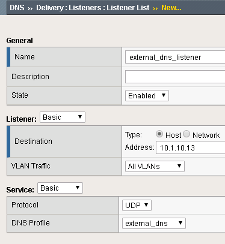
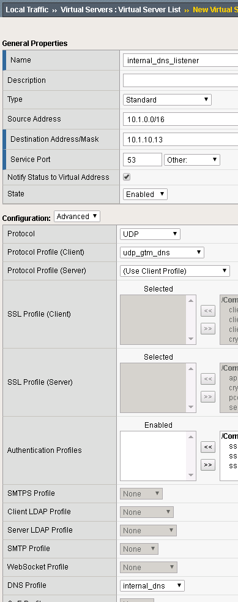
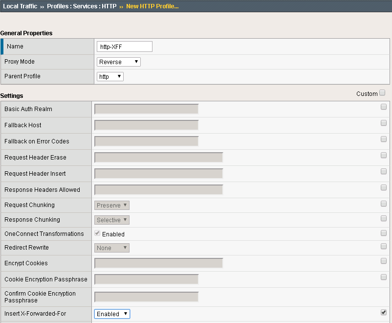
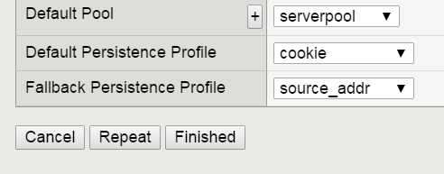
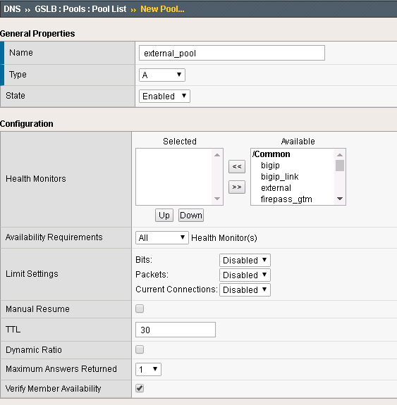
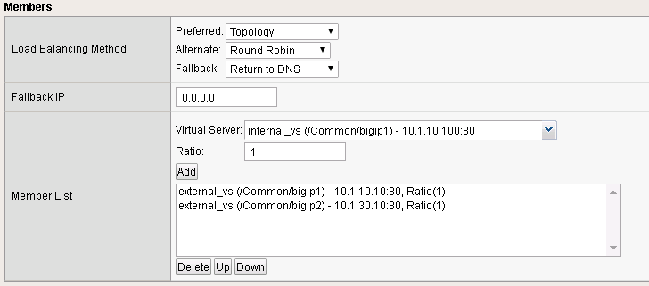
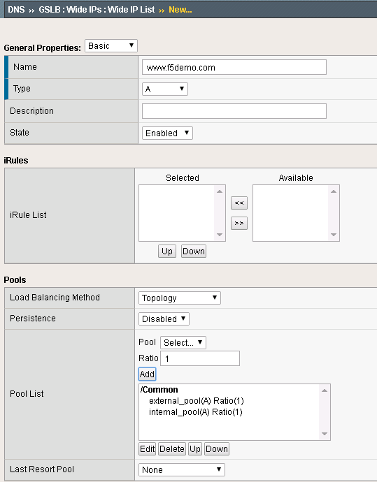
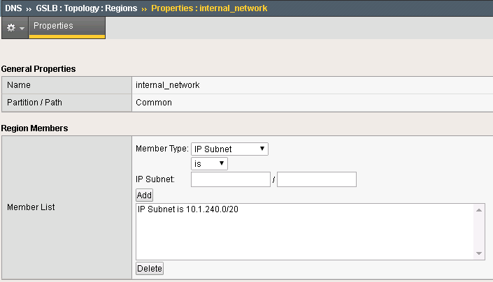
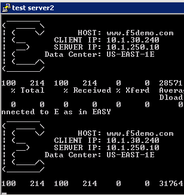
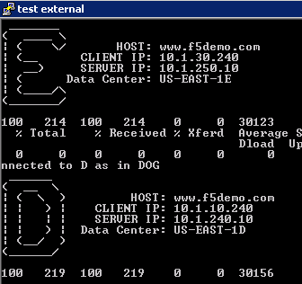

Creating BIG-IP DNS Sync Group
==============================

The following is adapted from the official F5 documentation:

https://support.f5.com/kb/en-us/products/big-ip-dns/manuals/product/bigip-dns-implementations-12-1-0/3.html#conceptid

First start by launching Google Chrome.

.. image:: google-chrome.png
   :scale: 50%
   :align: center

In Chrome you should see links to BIG-IP 1 and 2.  

.. image:: google-chrome-tabs.png
   :scale: 50%
   :align: center

Login to BIG-IP 1 *username: admin, password: admin*

.. image:: bigip-login.png
   :scale: 50%
   :align: center

Take a look at the current config.  You should see BIG-IP DNS is provisioned.

.. image:: bigip-provisioned.png
   :scale: 50%
   :align: center

There is an existing self IP.

.. image:: bigip-selfip.png
   :scale: 50%
   :align: center   
   
   
Configuring BIG-IP DNS
======================

The following will go through the basic steps of setting up BIG-IP DNS.

.. _gui_enable_sync:

Enabling DNS Sync
-----------------

First go to DNS -> Settings -> GSLB -> General

Find the "Synchronize" checkbox and click on it.

.. image:: enable-sync.png
   :scale: 50%
   :align: center

.. _gui_add_datacenter:

Add Data Center
---------------

Next go back to DNS -> GSLB -> Data Centers

Create a Data Center (DC) named SUBNET_10 and SUBNET_30.
   
.. image:: add-datacenter.png
   :scale: 50%
   :align: center

.. _gui_add_server:

Add Server
----------

Next go to DNS->GSLB->Servers

Create a server bigip1 associated with SUBNET_10 and bigip2 associated with SUBNET_30.   
   
======== ============= ===========
Name     Address       Data Center
======== ============= ===========
bigip1   10.1.10.240    SUBNET_10
bigip2   10.1.30.240    SUBNET_30
======== ============= ===========
   
.. image:: add-server.png
   :scale: 50%
   :align: center

.. _gui_gtm_add:

Syncing BIG-IP DNS
------------------

At this point BIG-IP 1 has the desired BIG-IP DNS configuration, but it needs to be synced with BIG-IP 2.

From the Desktop launch "Putty".

.. image:: launch-putty.png
   :scale: 50%
   :align: center

Find the BIG-IP 2 login.

.. image:: connect-bigip2-putty.png
   :scale: 50%
   :align: center

Login. *username: admin, password: admin*

.. image:: bigip2-putty-login.png
   :scale: 50%
   :align: center

Run the command:

.. code-block:: sh

 run /gtm gtm_add -a admin@10.1.10.240

.. image:: gtm_add.png
   :scale: 50%
   :align: center
   
.. warning:: In the lab the self-ip is configured to allow ALL services.  This is not a safe production configuration.

When prompted confirm/enter password.

.. image:: gtm_add-confirm.png
   :scale: 50%
   :align: center

In Chrome login to BIG-IP 2 and you should see that it is now synced.

.. image:: bigip2-synced.png
   :scale: 50%
   :align: center

You should have a pair of BIG-IP devices that are in a DNS Sync Group.  The next lab will go through the process of scripting these actions.

You are now ready to start the next Lab: :doc:`../lab3/scripted`

Optional Exercises
===================

The following next lab, :doc:`../lab3/scripted`,  will perform all of the following sections via an automation script.  You can choose to perform all of these tasks to understand what the automation will be performing, but at the end of this lab you will delete the work that you have done.  

.. _gui_dns_cache:

DNS Cache
---------

In the Demo environment we will use BIG-IP DNS as a DNS resolver.  Create a DNS cache named "dns_cache".  This needs to be done separately on each BIG-IP device.  

Under DNS -> Caches -> Cache List:
Create a DNS cache profile "dns_cache" and accept default values.

.. image:: internal_cache_profile.png
   :scale: 50%
   :align: center
   
.. _gui_dns_profile:

DNS Profiles
------------

Two DNS profiles are required. One for providing a resolving DNS server and one for external DNS requests (bad idea to have an open resolver on the internet). Now create them on both BIG-IP's.

.. _gui_external_dns_profile:

External DNS Profile
^^^^^^^^^^^^^^^^^^^^

Under DNS -> Delivery -> Profiles -> DNS:
Create a profile named "external_dns" that only provides GSLB and disables fallback to BIND.

.. image:: external_dns_profile.png
   :scale: 50%
   :align: center

.. _gui_internal_dns_profile:

Internal DNS Profile
^^^^^^^^^^^^^^^^^^^^

Under DNS -> Delivery -> Profiles -> DNS:
Create a profile named "internal_dns" that enables a DNS cache for resolving names.

.. image:: internal_dns_profile.png
   :scale: 50%
   :align: center

.. _gui_dns_listeners:

DNS Listeners
-------------

For external DNS we have two listeners for each BIG-IP. One external and one internal.
First create on both BIG-IP's the external Listeners. Apply the external_dns profile to each.
Use these IP addresses:

====== ========== =====
Device   Address    Port
====== ========== =====
bigip1 10.1.10.13 53
bigip2 10.1.30.13 53
====== ========== =====

.. _gui_external_dns_listener:

External DNS Listener
^^^^^^^^^^^^^^^^^^^^^

DNS -> Delivery -> Listeners

Here is the external DNS listener

.. _gui_internal_dns_listener:

Internal DNS Listener
^^^^^^^^^^^^^^^^^^^^^

Next create on each BIG-IP internal listeners via the LTM menu. The listener is a virtual server. Specify following source address range on each internal listener: 10.1.0.0/16, UDP profile is set to udp_gtm_dns, and apply the "internal_dns" DNS profile. Keep all other settings as default.

Use these IP addresses:

====== ========== =====
Device   Address    Port
====== ========== =====
bigip1 10.1.10.13 53
bigip2 10.1.30.13 53
====== ========== =====

Create listeners for external and internal DNS.  Name the external listener "external_dns_listener" and the internal listener "internal_dns_listener".
 
Here is an example of the internal Listener:

   
Note that the source address is set to 10.1.0.0/16,  , and the DNS profile is set to "internal_dns".

 For the demo all requests go through the internal listener, but in another environment you could split this out.

.. _gui_ltm:

LTM Configuration
------------------

Now we have to configure the LTM section of both BIG-IP's. Since both BIG-IP's are standalone the configuration steps has to be applied to both BIG-IP's.

First create an http profile named "http-XFF" that inserts X-Forwarded-For headers 
Local Traffic -> Profiles -> Services -> HTTP

In the Demo LTM is configured to use cookie persistence, insert X-Forwarded-For headers, and use Priority Groups for delivering traffic.

**Pools**

Create a pool "serverpool" on each BIG-IP. 
Local Traffic -> Pools

Assign HTTP and TCP monitors 
Enable Priority Group Activation with "1 Available Member"

======  ============== ==== ==============  ============== ==== ===============
Device  Pool Member #1 Port Priority Group  Pool Member #2 Port Priority Group
======  ============== ==== ==============  ============== ==== ===============
bigip1  10.1.240.10     80      10          10.1.250.10     80      0
bigip2  10.1.250.10     80      10          10.1.240.10     80      0
======  ============== ==== ==============  ============== ==== ===============

Pool config example:

.. image:: serverpool.png
   :scale: 50%
   :align: center

**Virtual Servers**

In the next step create two standard TCP virtual servers per BIG-IP.
One external and one internal. 
Apply the http-XFF profile, SNAT Automap and the pool "serverpool"

Use following IP addresses

======= =========== =========== ==== 
Device  Name        Address     Port 
======= =========== =========== ==== 
bigip1  external_vs 10.1.10.10   80  
bigip1  internal_vs 10.1.10.100  80  
bigip2  external_vs 10.1.30.10   80  
bigip2  internal_vs 10.1.30.100  80  
======= =========== =========== ==== 

Here a configuration example:

.. image:: external_vs_pt1.png
   :scale: 50%
   :align: center

.. image:: external_vs_pt2.png
   :scale: 50%
   :align: center
   

.. _gui_dns_topology:

DNS Topology
------------

After BIG-IP DNS and BIG-IP LTM are configured and ready to run, it is time to create the logical geographical load balancing.
BIG-IP DNS will receive DNS requests and respond based on the location of the requesting IP.

The demo will show two sections:

1. Split DNS: BIG-IP DNS will respond to internal clients with private IP addresses differently than for external clients with IP addresses that are not internal.
2. regional Loadbalancing - based on the region of the client IP the response will be different.
	Note: we will simulate the request with a private IP address range, because this lab is not exposed to the Internet.
	
The steps to create geolocation based load balancing on BIG-IP DNS are:

1. add the virtual servers
2. create the pools
3. create wide-IPs
4. create regions
5. create records

All configurations have to be applied one BIG-IP DNS only. The config changes will be synced to the other BIG-IP DNS via a sync group that was created before.

.. _gui_dns_vs:

**Step 1: Virtual Servers**
^^^^^^^^^^^^^^^^^^^^^^^^^^^

BIG-IP DNS has to be aware of the services that are provided by BIG-IP LTM.
BIG-IP DNS sees BIG-IP LTM as a Server that is bound to a datacenter. 
For BIG-IP DNS the virtual servers on the BIG-IP LTM are virtual servers on the server in the datacenter.

Create the virtual servers on BIG-IP DNS under:

DNS -> GSLB -> Servers

Use following IP addresses for the virtual servers: 

====== =========== ===============  ==============
Device Name        IP:PORT			Health Monitor
====== =========== ===============  ==============
bigip1 external_vs 10.1.10.10:80		bigip
bigip1 internal_vs 10.1.10.100:80 		bigip
bigip2 external_vs 10.1.30.10:80		bigip
bigip2 internal_vs 10.1.30.100:80		bigip
====== =========== ===============  ==============

Here an example:

.. image:: bigip_dns_vs_config.png
   :scale: 50%
   :align: center

.. _gui_dns_pool:

**Step 2: Pools** 
^^^^^^^^^^^^^^^^^

The next step is to configure the pool.
under: DNS -> GSLB -> Pools

Configure two pools (internal_pool and external_pool) with following load balancing methods:
* Preferred: Topology
* Alternate: Round-Robin
* Fallback: none

use following settings:

=============  ====   =======================================
Name           Type		Pool Members
=============  ====   =======================================
external_pool	 A	   bigip1:external_vs, bigip2:external_vs
internal_pool	 A	   bigip1:internal_vs, bigip2:internal_vs
=============  ====   =======================================

Here an example:

.. _gui_dns_wideip:

**Step 3: Wide IPs**
^^^^^^^^^^^^^^^^^^^^

The next step is to configure the Wide IP.
under: DNS -> GSLB -> Wide IPs

use following settings and Topology as load balancing method

===================== ==== ================================== ================
Name                  Type	Pools                              Last Resort pool
===================== ==== ================================== ================
www.f5demo.com         A    external_pool, internal_pool       external_pool
===================== ==== ================================== ================

Here an example:

.. _gui_dns_region:

**Step 4: Topology Regions**
^^^^^^^^^^^^^^^^^^^^^^^^^^^^

The next step is to define regions that will be used by topology records.
under DNS -> GSLB -> Topology -> Regions

Use following IP addresses:

================ ==========================
Name             Subnets
================ ==========================
internal_network 10.1.240.0/20
region_1         10.1.10.0/24,10.1.240.0/24
region_2         10.1.30.0/24,10.1.250.0/24
================ ==========================

Here an example:

.. _gui_dns_topology_records:

**Step 5: Topology Records**
^^^^^^^^^^^^^^^^^^^^^^^^^^^^

The last step is to define the topology records, that BIG-IP DNS will use for load balancing decisions
under DNS -> GSLB -> Topology -> Records

 
use following settings

=============================== =========  =============================
Source                          is/is not  Destination
=============================== =========  =============================
region /Common/internal_network is not     pool /Common/external_pool
region /Common/internal_network is         pool /Common/internal_pool
region /Common/region_1         is         region /Common/region_1
region /Common/region_2         is         region /Common/region_2
=============================== =========  =============================

Verifying configuration
-----------------------

Testing Internal Connections
-----------------------------

Now it is time to test if your configuration works.

Now run the "Test Server1" link.

.. image:: test-server1-run.png
   :scale: 50%
   :align: center

and run the "Test server2" link.

The "test-server[1-2]" links are simulating requests from internal clients.  
Note that BIG-IP DNS is configured to prefer requests to the same Data Center.

**Question** Can you explain how this is being done?

Testing External Connections
----------------------------

Find the "Test External" link.

.. image:: test-external.png
   :align: center   
   
Double-click on it and you should see:

The "Test External" link is simulating requests from an external client.  BIG-IP DNS is configured to use round-robin load balancing between the two backend servers.

From Google Chrome find the link for "www.f5demo.com".  The Windows Desktop client is configured to act like an external client.

**Question** Using Google Chrome the requests will always go back to the same server, why?

