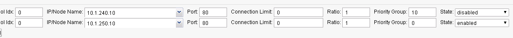

F5 Python SDK
=============

The F5 Python SDK provides an interface to the iControl REST interface.

This provides the ability to translate actions that you would have normally done via the GUI to actions that can be performed from Python.

**Via GUI**

.. image:: ../lab2/add-datacenter.png
   :scale: 50%
   :align: center

**Via Code**

.. code-block:: python

   def add_datacenter(self,datacenter):
         "add datacenter in BIG-IP DNS"
         self.mgmt.tm.gtm.datacenters.datacenter.create(name=datacenter,partition=self.partition)

This Lab will combine the process of creating a BIG-IP DNS deployment in Lab 2 and automate the process using the F5 Python SDK.  The Python code in this lab is run as a script to deploy BIG-IP configurations.  Think of this script like a remote tmsh Command Line Interface (CLI) to the BIG-IP.  Here's an example of adding a server to BIG-IP DNS using the script.

**CLI example**

.. code-block:: none

   python bigip_dns_helper.py --host=10.1.1.7 \
   --action add_datacenter --datacenter SUBNET_10

In this example we have created a Data Center (DC) named "SUBNET_10" using the F5 Python SDK example from before.  

A full description of sample inputs (taken from this lab) can be found at the end of this lab in the Lab Appendix.  :ref:`the_script`

For Python nerds; the pseudo code to invoke this from the CLI:

**Python Pseudo Code**

.. code-block:: python

   parser = OptionParser()
   parser.add_option('--host')
   parser.add_option('--datacenter')
   parser.add_option('--action')

   (options,args) = parser.parse_args()
   
   dns_helper = DnsHelper(options.host)

   if options.action == 'add_datacenter':
     dns_helper.add_datacenter(options.datacenter)

Restoring the BIG-IP Configuration
==================================

This step is to cleanup the BIG-IP config that was created in Lab 2.
RDP into the Windows jump host.

Reset both BIG-IP to be the same state as after Lab 1.

Find the "Resetting" links on the Desktop.

.. image:: ../lab1/resetting-links.png
   :scale: 75%
   :align: center

Double-click on both of these and you should see a window appear briefly like the following.

.. image:: ../lab1/resetting-bigip.png
   :scale: 50%
   :align: center

Verify that you no longer see the changes that were previously deployed.

Run Demo
========

This Lab is not intended to teach you how to write Python code, but instead demo how it can be leveraged to help automate a solution.

On the Desktop you will find the "Run Demo" link.  Double-click the link.

.. image:: run-demo.png
   :align: center

The script is currently configured to output all the REST calls making for a verbose output.

.. image:: run-demo-running.png
   :scale: 50%
   :align: center

An excerpt of the script that performs Lab 2 (create a DNS Sync Group):

.. code-block:: none

   python bigip_dns_helper.py --host=10.1.1.7 \
   --action enable_sync
   python bigip_dns_helper.py --host=10.1.1.7 \
   --action add_datacenter --datacenter SUBNET_10
   python bigip_dns_helper.py --host=10.1.1.7 \
   --action add_datacenter --datacenter SUBNET_30

   python bigip_dns_helper.py --host=10.1.1.7 \
   --action add_server  --datacenter SUBNET_10 --server_name bigip1 --server_ip=10.1.10.240
   python bigip_dns_helper.py --host=10.1.1.7 \
   --action add_server  --datacenter SUBNET_30 --server_name bigip2 --server_ip=10.1.30.240

   python bigip_dns_helper.py --host=10.1.1.7 \
   --action save_config
   sleep 3
   python bigip_dns_helper.py --host=10.1.1.8 \
   --action gtm_add --peer_host=10.1.1.7 --peer_selfip 10.1.10.240
   
There is the same number of steps involved, but one-click!

The full script can be found on `GitHub <https://github.com/f5devcentral/f5-dns-automation-demo-12-1-x/blob/master/f5-udf-2.0/udf.sh>`_.

Exploring the Demo
==================

Take a look at what has been deployed.  (Hint: Look at the Optional Exercise from Lab 2).

From the Network Map you can see that we have a set of external/internal DNS listeners and external/internal LTM Virtual Servers.

.. image:: network-map.png
   :scale: 50%
   :align: center

   
Application Services Integration iApp
-------------------------------------

The demo script utilizes the Application Services Integration iApp to deploy the LTM L4-L7 services.

.. image:: deployed-iapps.png
   :scale: 50%
   :align: center
   
**iApp Scripts**

The iApp is deployed using modified scripts from: https://github.com/F5Networks/f5-application-services-integration-iApp/tree/master/scripts

.. code-block:: none

   # import Application Services Integration iApp onto BIG-IP
   python iapps/import_template_bigip.py  --impl iapps/iapp.tcl --apl iapps/iapp.apl 10.1.1.7 appsvcs_integration_v2.0.003
   python iapps/import_template_bigip.py  --impl iapps/iapp.tcl --apl iapps/iapp.apl 10.1.1.8 appsvcs_integration_v2.0.003
   
   # Create L4-L7 services
   python iapps/deploy_iapp_bigip.py -r 10.1.1.7 iapps/sample_http.json --strings pool__addr=10.1.10.10 \
       --pool_members=0:10.1.240.10:80:0:1:10:enabled:none,0:10.1.250.10:80:0:1:0:enabled:none --iapp_name external_vs

   python iapps/deploy_iapp_bigip.py -r 10.1.1.8 iapps/sample_http.json --strings pool__addr=10.1.30.10 \
       --pool_members=0:10.1.250.10:80:0:1:10:enabled:none,0:10.1.240.10:80:0:1:0:enabled:none --iapp_name external_vs

   python iapps/deploy_iapp_bigip.py -r 10.1.1.7 iapps/sample_http.json --strings pool__addr=10.1.10.100 \
       --pool_members=0:10.1.240.10:80:0:1:10:enabled:none,0:10.1.250.10:80:0:1:0:enabled:none --iapp_name internal_vs

   python iapps/deploy_iapp_bigip.py -r 10.1.1.8 iapps/sample_http.json --strings pool__addr=10.1.30.100 \
       --pool_members=0:10.1.250.10:80:0:1:10:enabled:none,0:10.1.240.10:80:0:1:0:enabled:none --iapp_name internal_vs

You can view the parameters used to configure the iApp under iApps -> Application Services.

.. image:: iapp-config.png
   :scale: 50%
   :align: center
  
Testing Connections
-------------------

This demo is designed to provide a solution with the following attributes.

 * Two BIG-IP devices in separate Data Centers (Regions, Availability Zone, etc...)
 * Two backend servers in separate DC 
 * The two DC are routable to each other via L3
 * Provide recursive DNS for internal clients

The desired behavior for requests

 * External clients round-robin between backend servers
 * Persist External client requests to original DC server if requests move between DC
 * Internal client requests will have affinity to local DC server
 
   
Testing External Connections
----------------------------

Find the "Test External" link.

.. image:: test-external.png
   :align: center   
   
Double-click on it and you should see:

.. image:: test-external-run.png
   :scale: 50%
   :align: center

The "Test External" link is simulating requests from an external client.  BIG-IP DNS is configured to use round-robin load balancing between the two backend servers.

From Google Chrome find the link for "www.f5demo.com".  The Windows Desktop client is configured to act like an external client.

**Question** Using Google Chrome the requests will always go back to the same server, why?  (Hint: Look at the Optional Exercise from Lab 2).

Testing Internal Connections
-----------------------------
Now run the "Test Server1" link.

.. image:: test-server1-run.png
   :scale: 50%
   :align: center

and run the "Test server2" link.

.. image:: test-server2-run.png
   :scale: 50%
   :align: center

The "test-server[1-2]" links are simulating requests from internal clients.  Note that BIG-IP DNS is configured to prefer requests to the same Data Center.

**Question** Can you explain how this is being done?  (Hint: Look at the Optional Exercise from Lab 2).

Disabling a pool member
-----------------------

On BIG-IP 1 go to iApps -> Application Services 

Click on "external_vs" and click reconfigure.

Disable the external_vs pool member 10.1.240.10.

Re-run the external tests.

Please proceed to Lab 4. :doc:`../lab4/lab4_guide`

Optional Exercises
==================

Changing the requirements
-------------------------

Can you change the behavior to the following:

#. External requests will not persist to the same backend server (still round-robin, Hint: one change to each external LTM Virtual Server)
#. Flip the affinity of the internal requests (could be done via either LTM/DNS)
 
Automating the change
---------------------
The second change "flipping the affinity" can be done via changing the automation script to change how the LTM Virtual Servers are deployed. Reset the deployment and deploy with an updated deployment that implements that change.

 
Lab Appendix
============

The Python Script that is used in this lab was created by Eric Chen.  This is considered F5 contributed software.  `K80012344 <https://support.f5.com/csp/article/K80012344>`_ covers this.  

From K80012344.

 | **F5 contributed software**
 |
 | *F5 employees create and test software contributed to GitHub as part of supporting the development community related to F5 products. However, if the software is not a specific tagged release listed as F5 Supported in this article, and if the software is not also available on the F5 Downloads site, F5 does not provide technical support for them, and may refer you back to GitHub for community support for the project in question. For more information and for community discussions, refer to the information available for that software in the GitHub repository.*

.. _the_script:

The Script
----------

**Enable DNS Sync**
^^^^^^^^^^^^^^^^^^^

.. code-block:: none

  python bigip_dns_helper.py --host=[MGMT IP] \
                             --action enable_sync

This performs the GUI steps of :ref:`gui_enable_sync`

**Add Data Center**
^^^^^^^^^^^^^^^^^^^

.. code-block:: none

  python bigip_dns_helper.py --host=[MGMT IP] \
                             --action add_datacenter --datacenter [Data Center Name]

This performs the GUI steps of :ref:`gui_add_datacenter`

**Save Config**
^^^^^^^^^^^^^^^

.. code-block:: none

  python bigip_dns_helper.py --host=[MGMT IP] \
                             --action save_config

This performs the TMSH equivalent of:

.. code-block:: none

  save /sys config
  save /sys config gtm-only

This ensures that the running configuration is saved to disk.

**Syncing BIG-IP DNS**
^^^^^^^^^^^^^^^^^^^^^^

.. code-block:: none

  python bigip_dns_helper.py --host=[MGMT IP of BIG-IP that you will WIPE OUT DNS config] \
                             --action gtm_add 
                             --peer_host=[MGMT IP of BIG-IP you want to copy from] 
                             --peer_selfip [SELF IP of BIG-IP you want to copy from] 

This performs the steps of :ref:`gui_gtm_add`

**Create DNS Cache**
^^^^^^^^^^^^^^^^^^^^

.. code-block:: none

  python bigip_dns_helper.py --host=[MGMT IP] \
                             --action create_dns_cache

This performs the steps of :ref:`gui_dns_cache`

**Create External DNS Profile**
^^^^^^^^^^^^^^^^^^^^^^^^^^^^^^^

.. code-block:: none

  python bigip_dns_helper.py --host=[MGMT IP]  --action create_external_dns_profile

This performs the steps of :ref:`gui_external_dns_profile`

**Create Internal DNS Profile**
^^^^^^^^^^^^^^^^^^^^^^^^^^^^^^^^

.. code-block:: none

  python bigip_dns_helper.py --host=[MGMT IP]  --action create_internal_dns_profile

This performs the steps of :ref:`gui_internal_dns_profile`

**Create External DNS Listener**
^^^^^^^^^^^^^^^^^^^^^^^^^^^^^^^^

.. code-block:: none

  python bigip_dns_helper.py --host=[MGMT IP] \
                             --action create_external_dns_listener 
                             --listener_ip [Listener IP]

This performs the steps of :ref:`gui_external_dns_listener`

**Create Internal DNS Listener**
^^^^^^^^^^^^^^^^^^^^^^^^^^^^^^^^

.. code-block:: none

  python bigip_dns_helper.py --host=[MGMT IP] \
                             --action create_internal_dns_listener 
                             --listener_ip [Listener IP]
                             --internal_network [Network/CIDR]

This performs the steps of :ref:`gui_internal_dns_listener`

**Import iApp Template**
^^^^^^^^^^^^^^^^^^^^^^^^

.. code-block:: none

  python iapps/import_template_bigip.py  --impl [TCL file] \
                                         --apl  [APL File] \
                                                [MGMT IP] \
                                                [Name of Template]

This will import the `Application Services Integration iApp <https://github.com/F5Networks/f5-application-services-integration-iApp>`_.

**Deploy iApp**
^^^^^^^^^^^^^^^^

.. code-block:: none

  python iapps/deploy_iapp_bigip.py -r          [MGMT IP] \
                                                [JSON Input] \
                                     --strings  pool__addr=[Virtual Server IP] \
                                     --pool_members=0:[Member IP]:[Member Port]:0:1:[Priority Group]:enabled:none,\
                                                    0:[Member IP]:[Member Port]:0:1:[Priority Group]:enabled:none

This will deploy an iApp.  This is modified from the Application Services Integration iApp GitHub scripts to allow the specification of
"strings" and "pool_members" from the CLI.

This performs the steps from :ref:`gui_ltm`

**Create DNS Virtual Server**
^^^^^^^^^^^^^^^^^^^^^^^^^^^^^

.. code-block:: none

  python bigip_dns_helper.py --host=[MGMT IP] \
                             --action create_vs \ 
                             --vip [LTM VS IP]:[LTM VS Port] \
                             --vip_translate [LTM VS External IP]:[LTM VS External Port] 
                             --vs_name [DNS VS Name]
                             --server_name [Server Name (BIG-IP Device)]

This performs the steps from :ref:`gui_dns_vs`

**Create DNS Pools**
^^^^^^^^^^^^^^^^^^^^

.. code-block:: none

  python bigip_dns_helper.py --host=[MGMT IP] \
                             --action create_pool \
                             --name [Pool Name]

This performs the steps from :ref:`gui_dns_pool`.  The pool is configured with a Topology LB method.

**Create DNS Wide IP**
^^^^^^^^^^^^^^^^^^^^^^

.. code-block:: none

  python bigip_dns_helper.py --host=[MGMT IP]  \
                             --action create_wideip \
                             --name [DNS Name] --pool [DNS Pool #1],[DNS Pool #2]

This performs the steps from :ref:`gui_dns_wideip`.  The Wide IP is configured with a Topology LB method.

**Create Topology Regions**
^^^^^^^^^^^^^^^^^^^^^^^^^^^

.. code-block:: none

  python bigip_dns_helper.py --host [MGMT IP] \
                             --action create_region \
                             --name [Region Name] --internal_network [Subnet #1],[Subnet #2]

This performs the steps from :ref:`gui_dns_region`.

**Create Topology Records**
^^^^^^^^^^^^^^^^^^^^^^^^^^^

.. code-block:: none

  python  bigip_dns_helper.py --host [MGMT IP] 
                              --action create_topology_record 
                              --name [Topology Record]

This performs the steps from :ref:`gui_dns_topology_records`.  An example of a topology record: "ldns: region /Common/internal_network server: pool /Common/internal_pool"
