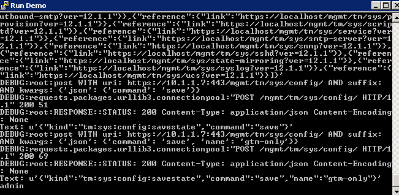
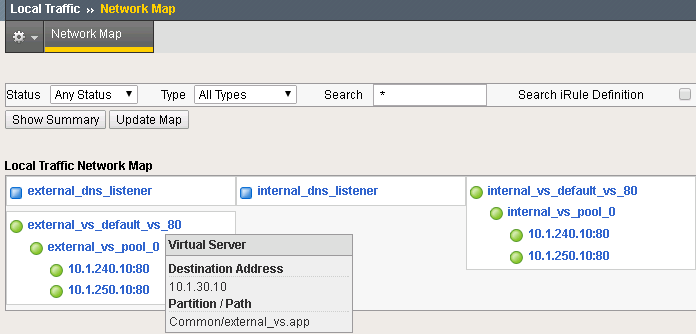

F5 Python SDK
=============

The F5 Python SDK provides an interface to the iControl REST interface.

This provides the ability to translate from actions that you would have normally done via the GUI to actions that can be performed from Python.

**Via GUI**

.. image:: ../lab2/add-datacenter.png
   :scale: 50%
   :align: center

**Via Code**

.. code-block:: python

   def add_datacenter(self,datacenter):
         "add datacenter in BIG-IP DNS"
         self.mgmt.tm.gtm.datacenters.datacenter.create(name=datacenter,partition=self.partition)

This Lab will combine the process of creating a BIG-IP DNS deployment in Lab 2 and automate the process using the F5 Python SDK.  Python code itself can be run as a script and this is used to be able to create our own utility to deploy BIG-IP configurations.  Think of it like a remote tmsh.  Command Line Interface (CLI) to the BIG-IP.  Here's an example of adding a server to BIG-IP DNS using the script.

**CLI example**

.. code-block:: none

   python bigip_dns_helper.py --host=10.1.1.7 \
   --action add_datacenter --datacenter SUBNET_10

In this example we have created a Data Center (DC) named "SUBNET_10" using the F5 Python SDK example from before.  For Python nerds the related code to invoke this from the CLI.

**Python Pseudo Code**

.. code-block:: python

   parser = OptionParser()
   parser.add_option('--host')
   parser.add_option('--datacenter')
   parser.add_option('--action')

   (options,args) = parser.parse_args()
   
   dns_helper = DnsHelper(options.host)

   if options.action == 'add_datacenter':
     dns_helper.add_datacenter(options.datacenter)

Run Demo
========

This Lab is not intended to teach you how to write Python code, but instead demo how it can be leveraged to help automate a solution.

On the Desktop you will find the "Run Demo" link.  Double-click the link.

The script is currently configured to output all the REST calls making for a verbose output.

A copy of the script that performs Lab 2 (create a DNS Sync Group):

.. code-block:: none

   python bigip_dns_helper.py --host=10.1.1.7 \
   --action enable_sync
   python bigip_dns_helper.py --host=10.1.1.7 \
   --action add_datacenter --datacenter SUBNET_10
   python bigip_dns_helper.py --host=10.1.1.7 \
   --action add_datacenter --datacenter SUBNET_30

   python bigip_dns_helper.py --host=10.1.1.7 \
   --action add_server  --datacenter SUBNET_10 --server_name bigip1 --server_ip=10.1.10.240
   python bigip_dns_helper.py --host=10.1.1.7 \
   --action add_server  --datacenter SUBNET_30 --server_name bigip2 --server_ip=10.1.30.240

   python bigip_dns_helper.py --host=10.1.1.7 \
   --action save_config
   sleep 3
   python bigip_dns_helper.py --host=10.1.1.8 \
   --action gtm_add --peer_host=10.1.1.7 --peer_selfip 10.1.10.240
   
There is the same number of steps involved, but one-click!

Exploring the Demo
==================

Take a look at what has been deployed.  (Hint: Look at the Optional Exercise from Lab 2).

From the Network Map you can see that we have a set of external/internal DNS listeners and external/internal LTM Virtual Servers.

   
Application Services Integration iApp
-------------------------------------

The demo script utilizes the Application Services Integration iApp to deploy the LTM L4-L7 services.

.. image:: deployed-iapps.png
   :scale: 50%
   :align: center
   
**iApp Scripts**

The iApp is deployed using modified scripts from: https://github.com/F5Networks/f5-application-services-integration-iApp/tree/master/scripts

.. code-block:: none

   # import Application Services Integration iApp onto BIG-IP
   python iapps/import_template_bigip.py  --impl iapps/iapp.tcl --apl iapps/iapp.apl 10.1.1.7 appsvcs_integration_v2.0.003
   python iapps/import_template_bigip.py  --impl iapps/iapp.tcl --apl iapps/iapp.apl 10.1.1.8 appsvcs_integration_v2.0.003
   
   # Create L4-L7 services
   python iapps/deploy_iapp_bigip.py -r 10.1.1.7 iapps/sample_http.json --strings pool__addr=10.1.10.10 \
       --pool_members=0:10.1.240.10:80:0:1:10:enabled:none,0:10.1.250.10:80:0:1:0:enabled:none --iapp_name external_vs

   python iapps/deploy_iapp_bigip.py -r 10.1.1.8 iapps/sample_http.json --strings pool__addr=10.1.30.10 \
       --pool_members=0:10.1.250.10:80:0:1:10:enabled:none,0:10.1.240.10:80:0:1:0:enabled:none --iapp_name external_vs

   python iapps/deploy_iapp_bigip.py -r 10.1.1.7 iapps/sample_http.json --strings pool__addr=10.1.10.100 \
       --pool_members=0:10.1.240.10:80:0:1:10:enabled:none,0:10.1.250.10:80:0:1:0:enabled:none --iapp_name internal_vs

   python iapps/deploy_iapp_bigip.py -r 10.1.1.8 iapps/sample_http.json --strings pool__addr=10.1.30.100 \
       --pool_members=0:10.1.250.10:80:0:1:10:enabled:none,0:10.1.240.10:80:0:1:0:enabled:none --iapp_name internal_vs

You can view the parameters used to configure the iApp under iApps -> Application Services.

.. image:: iapp-config.png
   :scale: 50%
   :align: center
  
Testing Connections
-------------------

This demo is designed to provide a solution with the following attributes.

 * Two BIG-IP devices in separate Data Centers (Regions, Availability Zone, etc...)
 * Two backend servers in separate DC 
 * The two DC are routable to each other via L3
 * Provide recursive DNS for internal clients

The desired behavior for requests

 * External clients round-robin between backend servers
 * Persist External client requests to original DC server if requests move between DC
 * Internal client requests will have affinity to local DC server
 
   
Testing External Connections
----------------------------

Find the "Test External" link.

   
Double-click on it and you should see:

.. image:: test-external-run.png
   :scale: 50%
   :align: center

The "Test External" link is simulating requests from an external client.  BIG-IP DNS is configured to use round-robin load balancing between the two backend servers.

From Google Chrome find the link for "www.f5demo.com".  The Windows Desktop client is configured to act like an external client.

**Question** Using Google Chrome the requests will always go back to the same server, why?  (Hint: Look at the Optional Exercise from Lab 2).

Testing Internal Connections
-----------------------------
Now run the "Test Server1" link.

.. image:: test-server1-run.png
   :scale: 50%
   :align: center

and run the "Test server2" link.

.. image:: test-server2-run.png
   :scale: 50%
   :align: center

The "test-server[1-2]" links are simulating requests from internal clients.  Note that BIG-IP DNS is configured to prefer requests to the same Data Center.

**Question** Can you explain how this is being done?  (Hint: Look at the Optional Exercise from Lab 2).

Optional Exercises
==================

Changing the requirements
-------------------------

Can you change the behavior to the following:

 * External requests will not persist to the same backend server (still round-robin, Hint: one change to each external LTM Virtual Server)
 * Flip the affinity of the internal requests (could be done via either LTM/DNS)
 
 Automating the change
 ---------------------
 The second change "flipping the affinity" can be done via changing the automation script to change how the LTM Virtual Servers are deployed.  Reset the deployment and deploy with an updated deployment that implements that change.