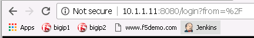
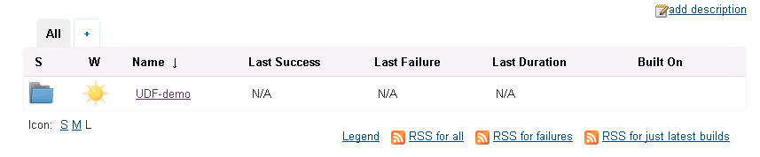
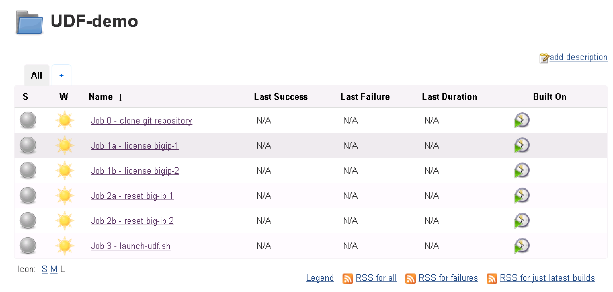
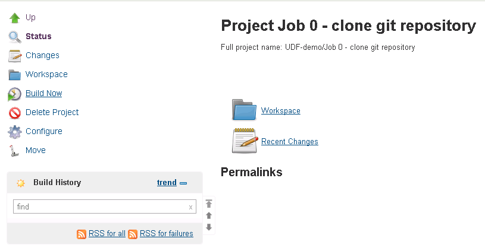
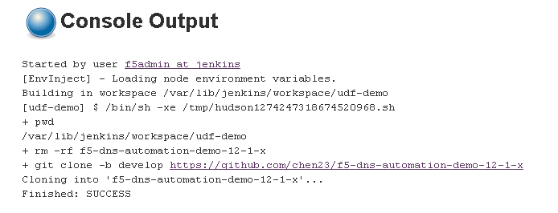
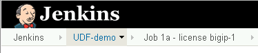
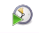

Welcome to the Lab 4 Lab Guide
==============================

This Lab will show how Jenkins as a build engine can help automate BIG-IP deployments.
The automation will be done in UDF 2.0

This Lab will perform following tasks:

#. License two BIG-IP
#. Reset the config
#. deploy the udf.sh script from lab3 to provision BIG-IP DNS and LTM, create DNS clusters, join LTM and DNS, deploy iapps and deploy BIG-IP DNS configuration 

This will be done without touching the BIG-IPs after the default config is loaded.

The goal of this lab is to demonstrate how complex automation tasks can be hidden behind a generic automation engine.
In this case the deployment is in UDF 2.0. Running through the Lab demonstrates how easy it is to change the destination to AWS or Azure or private cloud environments with keeping the shim layer unchanged.

Step 0
======

This step is to cleanup the BIG-IP config that was created in Lab 2 and 3.
RDP into the Windows jump host.
Open two Putty session and login to BIG-IP 1 and BIG-IP 2. Use the admin credentials from the previous labs.

Reset both BIG-IP to factory default
Use these commands:

**CLI example**

.. code-block:: none

	load /sys config default

after the system is in active state again save the default config with

**CLI example**

.. code-block:: none

	save /sys config

Step 1
======

After both BIG-IP are active again open Chrome in the RDP Session and click on the Jenkins link.

Login to the jenkins server. 
The credentials are on the RDP Desktop in the "Jenkins credentials.txt" file.

After login to the Jenkins Web interface, please note the UDF-demo folder.

The UDF-folder contains a collection of Projects/Jobs that can be started or build by Jenkins.
Click the UDF-demo folder.
In the UDF demo folder there are several Projects from job 0 to job 3.

   
In the nexxt steps these Jobs wil be build and the result verified.   

**Job 0**

The task of Job 0 is to download the repository for this lab from github to the Jenkins Servers local HDD.
This enables customer to test and deploy services always from the latest stable or develop cycle.

In the Jenkins GUI click on "Job 0 - clone git repository".
In order to run the project click on the left side the "Build Now" link.

   
Note that at the left side the "Buildung History" lit adds a new build.
Click at the new build number.
In the next screen there is a link called "Console Output"

Click on "Console Output"

In the middle of the screen the console output is displayed.

**Question** How is the deployment status?

In the task list click on UDF-demo to return to the folder

**Job 1a and 1b**

The task of Job 1a and Job 1b is to license the BIG=IP instances.

there are multiple ways to build a project. In this case click on the "Build On" button at the right side of the screen for Job 1a and Job 1b. 

**Question** What is the console status after the Job completed?

**Job 2a and 2b **

The task of Job 2a and 2b is to send the reset scripts from lab 2 and lab3 to the BIG-IP's.

Build the jobs 2a and 2b. 
Check the console output for both Projects and their status responses for success.

**Question** What is the console status after the Job completed?

**Job 3**

In Job 1 and 2 the BIG-IP were prepared to receive the configuration.
Job 3 deploys the udf.sh script from lab 3 to both BIG-IP's.
After this deployment the BIG-IP's are ready to serve the service.

Click "Build On" and monito the console output.

**Question** What is the console status after the Job completed?

 

