Jenkins Pipeline
================

During the prior lab :doc:`../lab4/lab4_guide` Jenkins was used to provide a frontend tool to launch the automation scripts from :doc:`../lab3/scripted`.

This lab will leverage Jenkins Pipeline to create a workflow that will validate the individual steps that are executing in a more declarative manner.

Restoring the BIG-IP Configuration
==================================

This step is to cleanup the BIG-IP config that was created in prior Labs.
RDP into the Windows jump host.

Reset both BIG-IP to be the same state as after Lab 1.

Find the "Resetting" links on the Desktop.

.. image:: ../lab1/resetting-links.png
   :scale: 75%
   :align: center

Double-click on both of these and you should see a window appear briefly like the following.

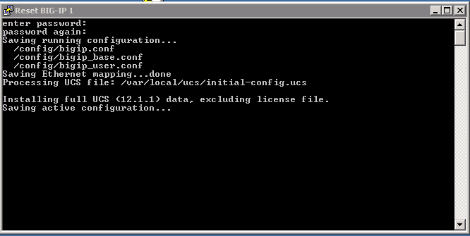

Verify that you no longer see the changes that were previously deployed.

Creating a pipeline
===================

Jenkins allows you to put together a collection of actions, branch on conditions, and measure the results.

This can be put together to put together a series of stages.

 * Stage 1: Enable DNS Sync
 * Stage 2: Cluster DNS Devices
 * Stage 3: Add additional DNS Configuration
 * Stage 4: Import App Svcs iApp Template
 * Stage 5: Deploy App Svcs iApp Template
 * Stage 6: Add DNS Configuration
 * Stage 7: Verify Configuration
 
To describe these stages we can create a "Jenkinsfile" that will instruct Jenkins to execute these stages.

The following will pull down a copy of the scripts used in this lab and execute the steps to create a DNS cluster.

.. code-block:: groovy
  
  stage('clone git repo') {
     node {
       git url: 'https://github.com/f5devcentral/f5-dns-automation-demo-12-1-x.git', branch:'master'
     }
  }

  stage('enable dns sync') {
    node {
      dir ('lib') {
                    sh 'python bigip_dns_helper.py --host=' + params.bigip1 + ' --action enable_sync'
                    sh 'python bigip_dns_helper.py --host=' + params.bigip1 + ' --action add_datacenter --datacenter ' + params.dc1 + ''
                    sh 'python bigip_dns_helper.py --host=' + params.bigip1 + ' --action add_datacenter --datacenter ' + params.dc2 + ''
                    sh 'python bigip_dns_helper.py --host=' + params.bigip1 + ' --action add_server  --datacenter ' + params.dc1 + ' --server_name bigip1 --server_ip=' + params.bigip1_selfip + ''
                    sh 'python bigip_dns_helper.py --host=' + params.bigip1 + ' --action add_server  --datacenter ' + params.dc2 + ' --server_name bigip2 --server_ip=' + params.bigip2_selfip + ''
                    sh 'python bigip_dns_helper.py --host=' + params.bigip1 + ' --action save_config'
      }
    }
  }
  stage('gtm add') {
    node {
        dir ('lib') {

                    sh 'sleep 3'
                    sh 'python bigip_dns_helper.py --host=' + params.bigip2 + ' --action gtm_add --peer_host=' + params.bigip1 + ' --peer_selfip ' + params.bigip1_selfip + ''
                    sh 'sleep 3'
        }
    }
  }
  stage('additional dns setup') {
    node {
        dir ('lib') {

                    sh 'python bigip_dns_helper.py --host=' + params.bigip1 + '  --action create_dns_cache'
                    sh 'python bigip_dns_helper.py --host=' + params.bigip2 + '  --action create_dns_cache'
                    sh 'python bigip_dns_helper.py --host=' + params.bigip1 + '  --action create_external_dns_profile'
                    sh 'python bigip_dns_helper.py --host=' + params.bigip2 + '  --action create_external_dns_profile'
                    sh 'python bigip_dns_helper.py --host=' + params.bigip1 + '  --action create_internal_dns_profile'
                    sh 'python bigip_dns_helper.py --host=' + params.bigip2 + '  --action create_internal_dns_profile'
                    sh 'python bigip_dns_helper.py --host=' + params.bigip1 + '  --action create_external_dns_listener --listener_ip ' + params.bigip1_dns_listener + ''
                    sh 'python bigip_dns_helper.py --host=' + params.bigip2 + '  --action create_external_dns_listener --listener_ip ' + params.bigip2_dns_listener + ''
                    sh 'python bigip_dns_helper.py --host=' + params.bigip1 + '  --action create_internal_dns_listener --listener_ip ' + params.bigip1_dns_listener + ' --internal_network ' + params.internal_network + ''
                    sh 'python bigip_dns_helper.py --host=' + params.bigip2 + '  --action create_internal_dns_listener --listener_ip ' + params.bigip2_dns_listener + ' --internal_network ' + params.internal_network + ''
                    sh 'python bigip_dns_helper.py --host=' + params.bigip1 + ' --action save_config'
                    sh 'sleep 3'
        }
    }
  }

Note that in this code example that we are no longer using hardcoded IP addresses.  These are now parameters that can be input when the pipeline is executed.  

The full code can be found on `GitHub <https://github.com/f5devcentral/f5-dns-automation-demo-12-1-x/blob/master/f5-udf-2.0/Jenkinsfile>`_.  
  
Launching the pipeline
======================

After both BIG-IP are active again open Chrome in the RDP Session and click on the Jenkins link.

.. image:: ../lab4/Jenkins-link.png
   :scale: 50%
   :align: center

Login to the jenkins server. 
The credentials are on the RDP Desktop in the "Jenkins credentials.txt" file.

After login to the Jenkins Web interface, please note the UDF-demo-pipeline folder.

Click on "UDF-demo-pipeline" and you should see.

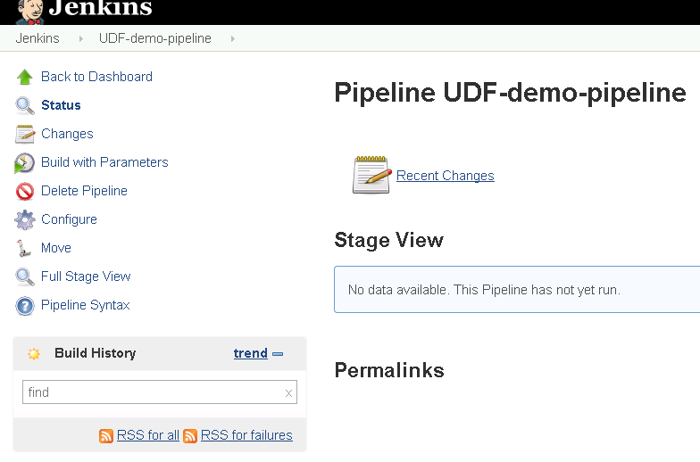

In order to run the project click on the left side the "Build with Parameters" link.  

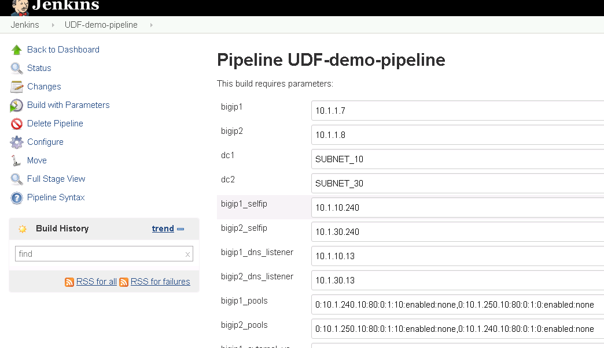
   
In previous labs all the input parameters were statically defined making the solution only usable with a specific network.  By utilizing parameters in Jenkins we are creating a solution that can be deployed more dynamically.

Scroll to the bottom of the page and find the "Build" button and click on it.
   
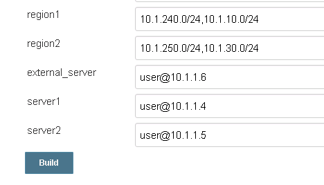

While the build is running you will see.

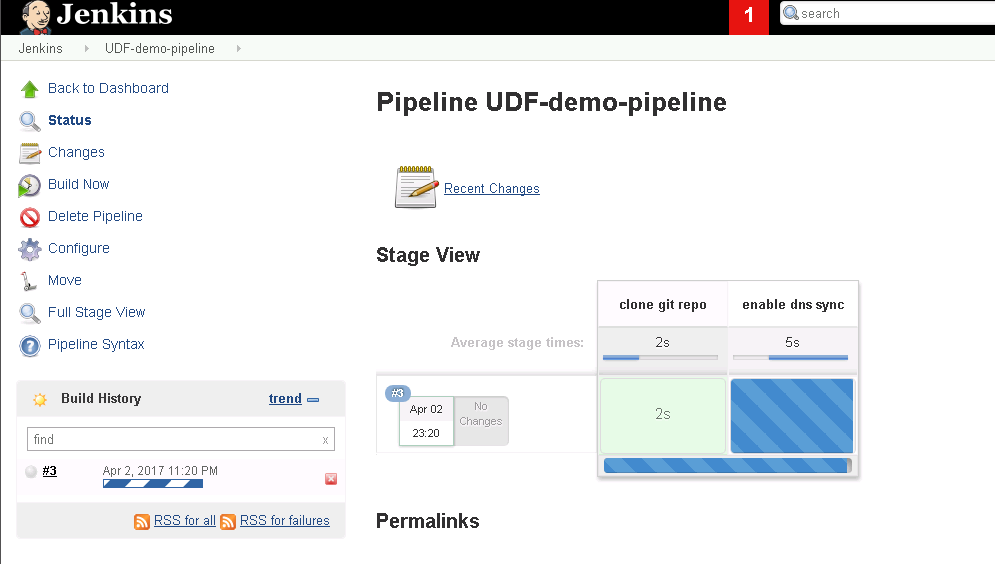
   
When the pipeline is complete you will see:

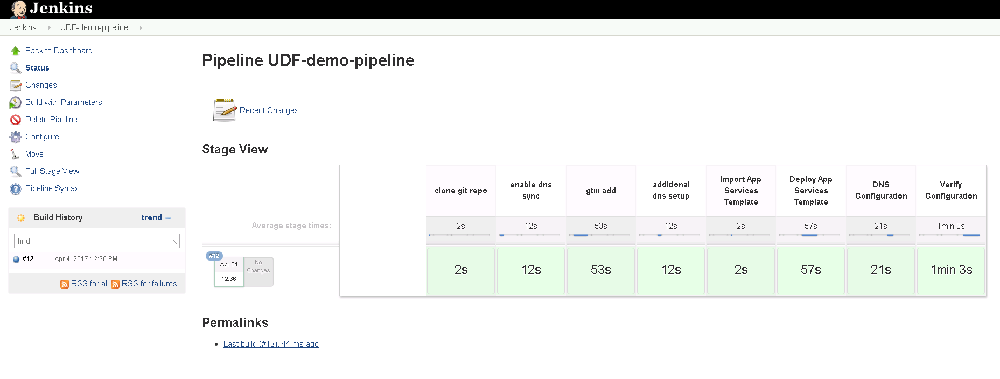
   
Failing Tests
=============

In the previous exercise we deployed a successful deployment.  In this exercise we will purposely break the pipeline.

Reset both BIG-IP to be the same state as after Lab 1.

Find the "Resetting" links on the Desktop.

.. image:: ../lab1/resetting-links.png
   :scale: 75%
   :align: center

Double-click on both of these and you should see a window appear briefly like the following.

Verify that you no longer see the changes that were previously deployed.

Go back to the 'UDF-demo-pipeline' page.

   
This time click on the "Configure" link.

Find the "Pipeline" section.

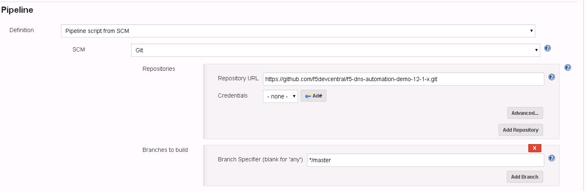
   
The current pipeline is configured to pull down a copy of the file "f5-udf-2.0/Jenkinsfile" from the f5devcentral GitHub repository.  We are going to download a local copy of this file and modify it to simulate a failure.

Select the pulldown for "Pipeline script from SCM" and change to "Pipeline Script".

Go to `GitHub <https://raw.githubusercontent.com/f5devcentral/f5-dns-automation-demo-12-1-x/master/f5-udf-2.0/Jenkinsfile>`_ and copy the text into your clipboard.  If you are using a Mac or your RDP client is not supporting copy and paste you can also find a copy of the file on your Desktop.  Browse to "Desktop\\f5-dns-automation-demo-12-1-x\\f5-udf-2.0".  Right click on the Jenkinsfile and "Edit with Notepad++".

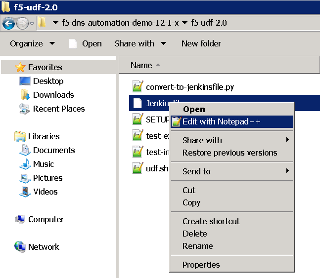

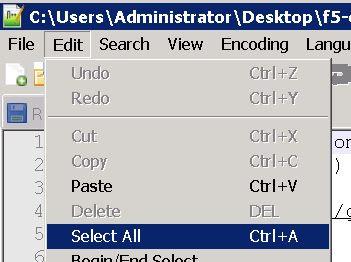
   
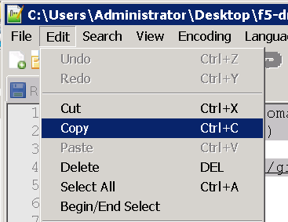

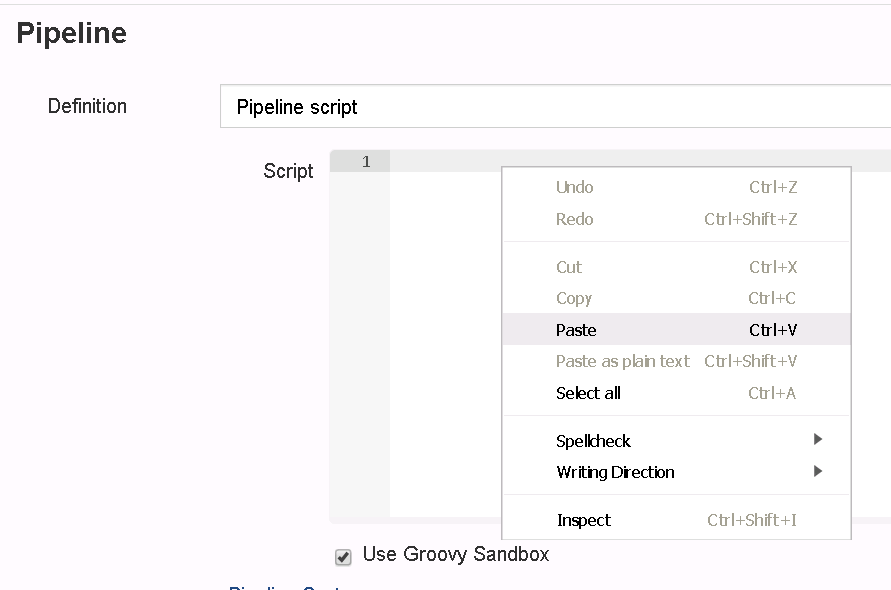
   
Paste the contents into the script text area.

Comment out the following lines (around line 100).

.. code-block:: groovy

  //sh 'python  bigip_dns_helper.py --host ' + params.bigip1 + '  --action create_topology_record --name "ldns: region /Common/region_1 server: region /Common/region_1"'
  //sh 'python  bigip_dns_helper.py --host ' + params.bigip1 + '  --action create_topology_record --name "ldns: region /Common/region_2 server: region /Common/region_2"'
  //sh 'python  bigip_dns_helper.py --host ' + params.bigip2 + '  --action create_topology_record --name "ldns: region /Common/region_1 server: region /Common/region_1"'
  //sh 'python  bigip_dns_helper.py --host ' + params.bigip2 + '  --action create_topology_record --name "ldns: region /Common/region_2 server: region /Common/region_2"'
  
The result should look something like:

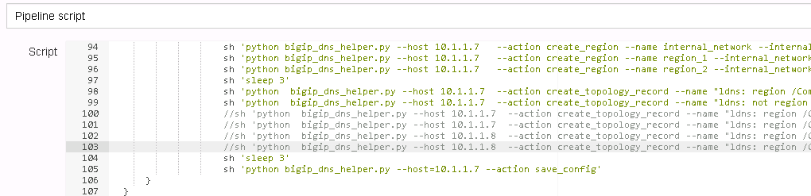

Now click on the Save Button.

Back on the pipeline page find the "Build with Parameters" link.  

   
Scroll to the bottom of the page and find the "Build" button and click on it.
   

Once the build completes you should see a failure.

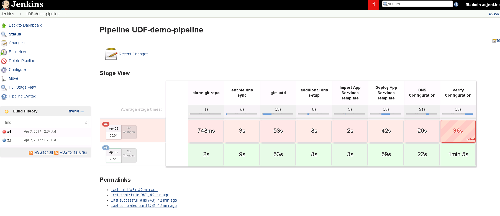

Hover your mouse over the failure.

.. image:: udf-demo-pipeline-failure-hover.png
   :scale: 75%
   :align: center

Click on "Logs" to see the detail and expand the failing task.

Hover your mouse over the failure.

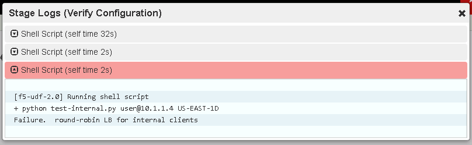

In this case the script "test-internal.py" exited with a non-zero exit code.  This causes Jenkins to treat this as a failure.  In this case the script was only expecting to see responses from a single Data Center and instead received responses from both Data Centers due to the lack of topology records.
